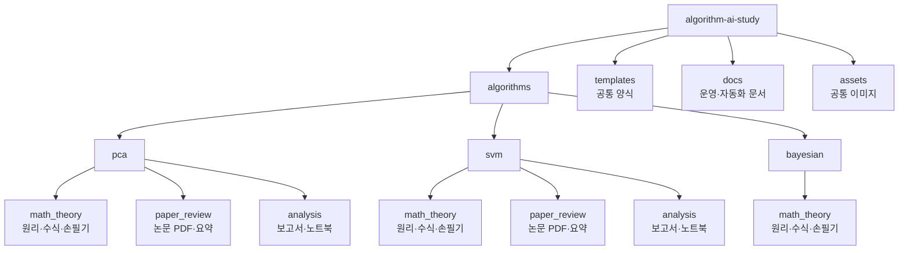

# Algorithm & AI Study Lab

머신러닝 알고리즘을 **원리 분석 → 문헌 기반 사례 분석 → 데이터 적용 실험**의 흐름으로 공부하고 기록하는 스터디 저장소입니다.

스터디의 목표는 특정 라이브러리 사용법을 빠르게 익히는 것이 아니라, 하나의 알고리즘을 다음 세 관점에서 반복적으로 학습하는 것입니다.

1. 알고리즘의 수학적 구조를 이해한다.
2. 실제 논문과 사례에서 알고리즘이 어떻게 쓰이는지 확인한다.
3. 직접 데이터에 적용하며 결과를 해석한다.

## Study Flow

| 단계 | 공부 방식 | 사용하는 자료 | 정리 위치 |
|---|---|---|---|
| 01. Principle Analysis | 알고리즘의 가정, 목적함수, 핵심 수식, 최적화 구조를 공부합니다. | 교재, 손필기 노트, 발표 자료 | `math_theory/` |
| 02. Paper Review | 논문에서 문제 설정, 데이터, 방법론, 결과를 읽고 알고리즘의 활용 방식을 정리합니다. | 논문 PDF, Notion 보고서 | `paper_review/` |
| 03. Applied Project | 공개 데이터셋에 알고리즘을 적용하고 실험 결과를 해석합니다. | 보고서 PDF/MD, `.ipynb` | `analysis/` |

## Study Log

| 주차 | 알고리즘 | 과제 유형 | 진행 내용 | 회의록 | GitHub 결과 |
|---|---|---|---|---|---|
| W3 | PCA | `math_theory` | PCA 수학 원리 학습 | [회의록](meetings/w3_pca_math_theory.md) | 결과 파일 확인 필요 |
| W4 | PCA | `paper_review` | PCA 논문/사례 리뷰 | [회의록](meetings/w4_pca_paper_review.md) | 결과 파일 확인 필요 |
| W5 | PCA | `analysis` | PCA 적용 분석 | [회의록](meetings/w5_pca_analysis.md) | 결과 파일 확인 필요 |
| W6 | SVM | `math_theory` | SVM 수학 원리 학습 | [회의록](meetings/w6_svm_math_theory.md) | [폴더](algorithms/svm/math_theory/README.md) · 파일 확인 필요 |
| W7 | SVM | `paper_review` | SVM 논문/사례 리뷰 | [회의록](meetings/w7_svm_paper_review.md) | [논문 리뷰](algorithms/svm/paper_review/README.md) |
| W8 | SVM | `analysis` | SVM 적용 분석 | [회의록](meetings/w8_svm_analysis.md) | 결과 파일 확인 필요 |
| W9 | Bayesian | `math_theory` | Bayesian 수학 원리 학습 | 회의록 파일 추가 필요 | [수학 필기 PDF](algorithms/bayesian/math_theory/files/w9_bayesian_math_theory_박중현.pdf) |

## Repository Map

## Algorithms

| 알고리즘 | 원리 분석 | 논문 리뷰 | 적용 프로젝트 |
|---|---|---|---|
| [PCA](algorithms/pca/README.md) | [폴더](algorithms/pca/math_theory/README.md) · 결과 파일 확인 필요 | [폴더](algorithms/pca/paper_review/README.md) · 결과 파일 확인 필요 | [폴더](algorithms/pca/analysis/README.md) · 결과 파일 확인 필요 |
| [SVM](algorithms/svm/README.md) | [폴더](algorithms/svm/math_theory/README.md) · 파일 확인 필요 | [리뷰와 PDF](algorithms/svm/paper_review/README.md) | [폴더](algorithms/svm/analysis/README.md) · 결과 파일 확인 필요 |
| [Bayesian](algorithms/bayesian) | [수학 필기 PDF](algorithms/bayesian/math_theory/files/w9_bayesian_math_theory_박중현.pdf) | 준비 중 | 준비 중 |

## Notion and GitHub

| 도구 | 역할 |
|---|---|
| Notion | 일정 관리, 과제 제출, 원본 보고서 작성 |
| GitHub | 제출 파일, 노트북, 요약본, 회의록 보관 |
